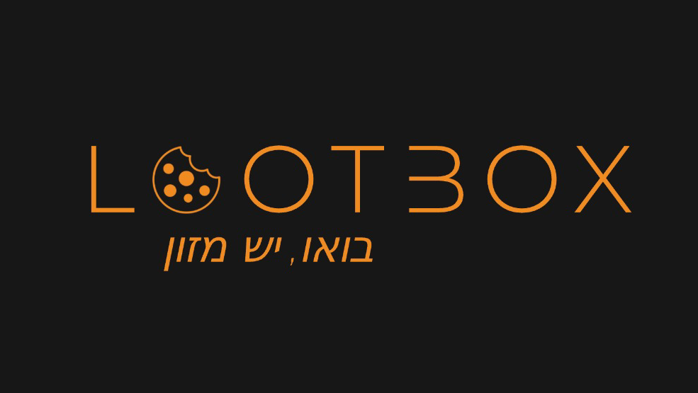

# LootBox - Video Game Powered Vending Machine



# 👩‍🔬👨‍🔬 Installation

```bash
git clone https://github.com/NatanelMizrahi/lootbox.git
cd lootbox
python3 -m pip install requirements.txt
```

# 👟 Run The Server

```bash
python3 server.py 
```

# 🕹 How to Play

### 🎮 Connect A Gamepad

Any USB gamepad should do the trick

### 💻 Open your browser

Open any of these links in your browser after running the server:

* [Flaming Tower](https://localhost:5000/game/tower)
* [Flappy Burner](https://localhost:5000/game/flappy)
* [Guacamole](https://localhost:5000/game/guacamole)
* [Pickle Rick Pong](https://localhost:5000/game/pong)

##### Notes

* If you insist, you may play without a gamepad ⌨. Just set `GAMEPAD_ACTIVE = false;`
  within [common.js](static/common/common.js) and rerun the server.